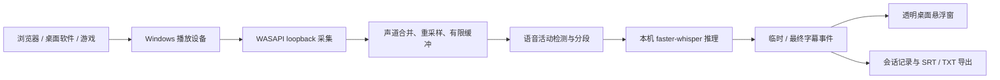

# 实时字幕工具：项目设计

状态：系统音频、麦克风、SenseVoice/Whisper 识别、中日英离线互译已实现；验证详情见 README.md。本文保留首版方案，新增范围以第二版补充为准。  
目标平台：Windows 桌面；覆盖浏览器、桌面软件和游戏播放的声音。  
产品形态：独立运行的桌面伴随程序，提供系统音频采集和悬浮字幕。通用桌面音频不依赖某个软件的插件接口，因此不能用单一浏览器扩展完成全部场景。

## 1. 用户目标与首版范围

### 第四版补充：Qwen 本地直译

默认翻译器升级为 Qwen3-4B-Instruct-2507 Q4_K_M（Unsloth 量化），llama.cpp CUDA 执行中日英直译；Argos 保留可选。仍沿用第三版临时翻译与最终任务优先队列，原文识别引擎不变。Qwen 使用非思考模式、2048 上下文和 256 输出 token 限制；异常、空结果或截断输出保留原文。对比样例与限制见 `docs/QWEN_TRANSLATION.md`。

架构例外：ASR 仍使用本机命名管道；Qwen 服务由 worker 启动，使用仅回环地址随机端口和每会话密钥，不使用云服务。Windows Job Object 管理所启动的服务，worker 正常或异常退出时释放资源。Qwen 模型和独立引擎支持界面下载及分发打包。

### 第二版补充：中日英字幕与翻译

主要场景是日语、英语音频生成中文字幕，同时支持中日英任意源语言到任意目标语言。新增 SenseVoiceSmall ONNX int8 CPU 后端，保留 Whisper 并提供 medium、large-v3-turbo、large-v3 下载选项。识别与翻译分开选择；中文到中文保留原文，不重复生成译文。

识别结果进入独立翻译线程，原文先显示，译文按 segmentId 补回。第三版开始翻译临时结果，只保留最新的待执行预览；最终任务优先，队列最多 8 条。过期预览不显示，界面同时核对 segmentId 与 sourceText，临时结果不写入记录和导出。满队列、未知语言或模型失败保留原文并显示原因；停止时丢弃待执行预览并排空最终翻译。支持原文、译文、双语显示及 SRT/TXT 导出。

当前离线翻译采用 Argos 的 en↔zh、en↔ja 四个 CTranslate2 包，ja↔zh 经过英语中转，界面明确提示。它是可离线运行的基线，不能据此保证游戏口语、专名或长句的翻译质量。模型评估与后续候选见 `docs/MODEL_COMPARISON.md`。音频和字幕不发送到翻译服务。

Whisper 与翻译支持 GPU，自动模式检查显卡与项目专用 CUDA 12/cuDNN 9 DLL，未满足时回退 CPU；手动 CUDA 模式失败会提示。第三版已在 RTX 4060 实测 Whisper base 与翻译 CUDA 推理。SenseVoice 固定 CPU ONNX；尚未集成 Qwen3-ASR 或 Seed-ASR。游戏内性能和界面表现仍需单独验证。

用户启动程序后点击「开始字幕」，程序自动采集当前默认播放设备上的声音，识别其中的语音，在其他窗口上方显示字幕。浏览器视频、会议软件、播放器和游戏只要通过该播放设备正常出声，都进入同一条采集链路。用户不需要为每个软件分别安装插件，也不需要选择麦克风。

首版功能：

- Windows 11 优先；系统音频采集、可选择播放设备，并在默认设备切换时提示重新连接。
- 中文、英文和自动语言识别；逐句显示临时和最终字幕。
- 桌面悬浮字幕：透明背景、置顶、可拖动、可调整字号和透明度、可锁定为鼠标穿透；提供全局开始/停止快捷键和托盘控制。
- 会话记录与 SRT、TXT 导出；默认不保存音频，记录只在当前会话中保留，用户主动保存才落盘。
- 完全本机识别；首次下载模型后可离线使用。明确显示模型未就绪、没有声音、识别积压及采集失败。

**默认捕获的是该播放设备的全部混合声音。** 如果网页、会议通知和游戏同时发声，它们可能一起进入识别器。Windows 11 上增加「指定应用」采集模式作为第二阶段，以便只识别某个程序；浏览器「只捕获一个标签页」则保留为后续可选扩展。

根据使用反馈，首版增加「麦克风」音源，用于识别用户自己说话。系统声音与麦克风是可切换的两种来源，单次会话只启用一种，不进行混音或回声消除。

首版不做翻译、说话人分离、云同步和视频原始时间轴对齐。字幕内容是转写，不能保证音乐歌词、多人重叠讲话或强噪声场景的准确率。

## 2. 核心使用流程

1. 首次运行时检测 Windows 版本、输出设备及本机模型；缺少模型时引导下载并显示大小、进度和失败原因。
2. 用户可直接点击「开始字幕」。程序默认选择 Windows 当前默认输出设备；也可手动选耳机、扬声器等设备。
3. 程序显示「等待声音」或「正在识别」状态。识别到的语音在独立悬浮窗中先出现临时结果，句子结束后转为最终结果。
4. 用户继续正常使用浏览器、桌面软件或游戏；可用快捷键显示/隐藏字幕、开始/停止采集。
5. 停止后清空采集缓冲，保留本次最终字幕供查看和导出。退出程序时未导出的记录被删除，并提前提示。

## 3. 系统架构



### 模块与技术选型

| 模块 | 方案 | 责任 |
| --- | --- | --- |
| 桌面程序 | C# / WPF | 主窗口、托盘、快捷键、字幕悬浮窗、导出及设备管理 |
| 系统音频采集 | WASAPI shared-mode loopback | 读取指定输出设备的混合音频；采集过程不改变原声播放 |
| 音频处理 | 桌面进程内 | 将设备实际格式转换为 16 kHz 单声道 PCM16；记录帧序号和采样时间 |
| 识别工作进程 | Python + `faster-whisper` + VAD | 加载本机模型、切句、生成临时与最终字幕 |
| 进程通信 | 仅本机的命名管道 | 传递音频帧、控制指令和字幕事件，不开放网络端口 |

使用独立识别进程，可避免模型加载或推理阻塞界面与音频采集。桌面程序负责启动、监测、关闭识别进程；识别进程异常退出时，界面显示错误并停止采集。分发包应包含运行所需的 Python 环境和采集依赖，用户无需自行配置开发环境。模型单独下载，便于选择速度和精度。

系统混合音频由 Windows 共享模式的播放设备回环取得。根据 [Microsoft WASAPI loopback 文档](https://learn.microsoft.com/en-us/windows/win32/coreaudio/loopback-recording)，该模式捕获某个输出端点正在播放的内容；独占模式音频及受保护内容存在系统层面的限制。首版必须检测采集数据实际是否有声音，不能把「设备已连接」误当作「已取得语音」。

### 音频与识别时序

- 采集线程以小帧读取设备音频，按设备真实采样率重采样，不能仅修改采样率标签。
- 音频帧与 UI、推理线程分开；有限缓冲防止游戏长时间运行时内存持续增长。推理落后时显示积压时长，超过上限时明确暂停/报错，不悄悄跳过音频。
- 语音活动检测在静音约 600 ms 后结句，连续讲话超过约 5 s 时分段。讲话期间每约 1–2 s 更新当前临时字幕；推理速度受模型和硬件影响。
- 首选多语言 `base` 模型和 CPU `int8`，提供 `tiny`（更快）与 `small`（更准）选项；有合适 GPU 的机器可在后续阶段提供加速选项。模型的实际延迟必须在目标设备上测量。
- 时间戳从实际采集到的样本数计算。切换设备或采集中断时标记时间断点，避免导出的字幕时间突然回退。

## 4. 字幕事件与记录

识别进程向桌面程序发送以下事件，所有事件带 `sessionId`：

```json
{"type":"partial","segmentId":4,"startMs":12300,"endMs":14200,"text":"正在识别的内容"}
{"type":"final","segmentId":4,"startMs":12300,"endMs":14750,"text":"最终识别内容。","language":"zh"}
{"type":"status","state":"listening"}
{"type":"error","code":"DEVICE_LOST","message":"音频设备已断开"}
```

同一 `segmentId` 的临时结果替换当前显示；最终结果只提交一次，并追加到会话记录。停止指令发出后处理最后一段语音，再返回 `done`，然后才能完成导出。SRT 时间戳相对于**本次采集开始时间**，用于保存转写记录；它不会自动对应某个视频文件的播放进度。单个识别会话只允许一个活跃音源，避免两路音频在时间线上混合。

## 5. 桌面与游戏字幕显示

默认悬浮窗采用透明、置顶、无边框的 WPF 窗口，放在屏幕底部。锁定后鼠标可以穿透字幕层，不挡游戏操作；按全局快捷键可暂时解锁并移动位置。多显示器环境允许选择字幕显示器，并在分辨率或缩放变化后限制窗口位置到可见区域。

普通桌面窗口和**无边框窗口化游戏**是首版保证验证的显示模式。独占全屏游戏的覆盖层显示受游戏渲染方式限制，普通置顶窗口可能不可见；首版应提示切换到无边框窗口化，而不能声称支持所有独占全屏游戏。若以后要覆盖更多全屏游戏，可单独研究 Xbox Game Bar 小组件的置顶模式。字幕工具不向游戏进程注入代码，也不绕过反作弊机制。[Xbox Game Bar 小组件文档](https://learn.microsoft.com/en-us/xbox/game-bar/api/xgb-widget)提供了独立的游戏内窗口接口。

## 6. 指定应用采集与浏览器场景

第二阶段的「指定应用」模式在支持的 Windows 版本上使用 process loopback，只读取选定进程及子进程的播放声音；这比系统混音更适合同时运行游戏和语音聊天的场景。选中应用重启或 PID 改变后需重新绑定。该接口的最低系统构建要求见 [Microsoft 的应用回环捕获示例](https://learn.microsoft.com/en-us/samples/microsoft/windows-classic-samples/applicationloopbackaudio-sample/)；不支持时隐藏此模式，保留系统音频模式。

浏览器网页本身也通过 Windows 输出设备出声，因此无需浏览器扩展即可显示网页字幕。若用户想在多个标签页同时播放声音时只识别其中一个标签页，可在后续加入 Chrome / Edge 扩展，以 `tabCapture` 作为新的采集适配器，继续使用同一识别事件协议与桌面悬浮窗。

## 7. 隐私、故障与资源管理

- 音频和字幕默认只在本机内存中处理。模型下载是唯一默认需要联网的步骤；UI 明确展示下载来源与缓存位置。日志只记录设备、时延和错误码，不记录原始音频或完整转写。
- 停止或退出时关闭 WASAPI 流、清空缓冲、通知识别进程结束；异常崩溃后重启时默认保持停止状态，不自动开始监听。
- 耳机拔出、默认设备变化、设备被占用、进入独占模式、没有声音、模型加载失败、推理进程退出，都有独立状态提示和恢复操作。
- 不对采集到的音频再次播放，防止回声；采集自身发出的提示音和其他系统通知仍可能出现在系统混音中，首版可默认禁用提示音。
- 受保护音频可能无法通过回环捕获；对此显示可诊断的空音频状态，不尝试绕过内容保护。

## 8. 分阶段实施与验收

| 阶段 | 交付结果 | 验收重点 |
| --- | --- | --- |
| 1. 采集原型 | 托盘程序、设备选择、WASAPI loopback、音量状态 | 浏览器、播放器和游戏音频可在同一设备上采集；原声正常；停止后无后台采集 |
| 2. 字幕主链路 | VAD、本机模型、临时/最终字幕、悬浮窗 | 中英文语音连续显示；无边框游戏中字幕可见；窗口可锁定并鼠标穿透 |
| 3. 记录与稳健性 | SRT/TXT、模型管理、设备切换和崩溃恢复 | 字幕时间顺序正确；长时运行无缓冲增长；错误有明确状态 |
| 4. 音源精细化 | Windows 11 指定应用采集 | 只识别目标进程；进程退出和重启后行为明确 |

验收样本应包括：浏览器视频、会议软件、媒体播放器、无边框游戏，以及游戏中同时播放通知声的场景。除了人工检查识别准确率，还需量测“说话结束到最终字幕显示”的分位延迟、CPU/内存占用和长时稳定性。没有实际硬件测试前，不承诺固定的秒数或所有游戏的全屏覆盖能力。

## 9. 仍需确认的体验选择

当前方案默认「系统全部播放声音」即可满足浏览器、桌面软件和游戏；「指定应用」放在第二阶段。若用户更重视首版就排除其他应用的声音，应把指定应用模式提前，并将最低系统要求限定为支持 process loopback 的 Windows 构建。

## 参考

- [Microsoft：WASAPI 回环录音](https://learn.microsoft.com/en-us/windows/win32/coreaudio/loopback-recording)
- [Microsoft：指定应用音频回环捕获](https://learn.microsoft.com/en-us/samples/microsoft/windows-classic-samples/applicationloopbackaudio-sample/)
- [Microsoft：Xbox Game Bar 小组件](https://learn.microsoft.com/en-us/xbox/game-bar/api/xgb-widget)
- [faster-whisper 项目](https://github.com/SYSTRAN/faster-whisper)
